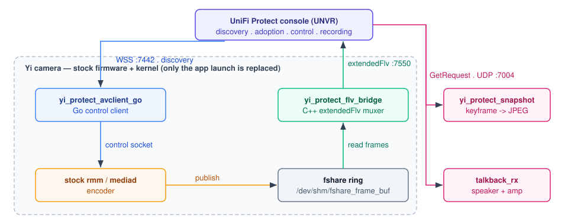

# yi-protect — present a cheap Yi camera as a native UniFi Protect camera

<div align="center">

<a href="LICENSE"></a>
<a href="../../releases"></a>

**Connects cheap Yi cameras (Allwinner V831-class) to a UniFi Protect console as
if they were native Ubiquiti cameras.**
**The camera keeps its stock firmware and encoder; the bridge muxes its output
into Protect's native `extendedFlv`, so the console does no decode/re-encode —
and adds low-latency live view, talkback, snapshots, motion and IR control.**

</div>

> [!WARNING]
> **Proof of concept, not a product.** It patches the camera's boot and runs
> custom binaries on it, so you can **brick the camera**, lose recordings, and
> void its warranty. It runs on the authors' own hardware and is **not
> recommended for production**. See [Disclaimer](#disclaimer).

> [!NOTE]
> Not affiliated with Ubiquiti Inc. or YI Technology / Kami Vision. No Ubiquiti
> or Yi firmware or binaries are distributed here. Built with AI assistance under
> human review. See [Legal](#legal).

## Quick start

Download the SD package from [Releases](../../releases), write it to a FAT32 SD
card, and boot the camera:

```
tar xzf yi-protect-<tag>.tar.gz -C /mnt     # an empty FAT32 card mounted at /mnt
sync && umount /mnt
# insert the card, power on -- the firmware installs and reboots
# then adopt the camera in Protect like any UniFi device
```

The first boot writes a full flash backup before it changes anything. Full
detail: [Install](#install-prebuilt).

## At a glance

|  |  |
| --- | --- |
| **What** | A bridge that presents a Yi camera to UniFi Protect as a native camera |
| **Hardware** | Yi cameras on Allwinner sun8iw19 / V831 (y623, h51ga, h52ga, r35gb, y291ga) |
| **Interface** | UBNT L2/UDP discovery + WSS `:7442`; media over `extendedFlv` `:7550`; talkback `:7004` |
| **Language** | C++ (bridge, snapshot, talkback), Go (control client), POSIX shell (boot) |
| **Status** | Working on real hardware (adoption, live, recording, snapshots, motion, talkback, PTZ); proof of concept |
| **License** | AGPL-3.0-or-later |

## How it compares

|  | Genuine UniFi camera | This project |
| --- | --- | --- |
| **What it is** | Ubiquiti's own Protect camera | A stock Yi camera presented as one |
| **Hardware** | Native UniFi SoC | Stock Yi Allwinner V831 camera + SD card |
| **Cost** | Buy a camera | An already-owned Yi camera |
| **Media path** | Native encode | The camera's own stock encoder, muxed into `extendedFlv` |
| **Fidelity** | Supported | Proof of concept — stock firmware kept, identity spoofed; rough edges |

## How it works

The camera keeps its stock vendor firmware and kernel. This project adds a
self-contained stack on the SD card (`/tmp/sd/yi-protect/`) and patches
`/backup/init.sh` to launch it at boot. The stock low-level bring-up
(sensor/ISP/encoder) still runs; only the app launch is replaced.

```
Protect console (UNVR)
  │  WSS :7442  ubnt_avclient_*  (discovery / adoption / control)
  ▼
yi_protect_avclient_go ──► stock rmm / mediad ──► fshare ring ──► yi_protect_flv_bridge
                                                                    └─ extendedFlv :7550 ─► UNVR
```



| Component | Language | Role |
| --- | --- | --- |
| `yi_protect_flv_bridge` | C++ | Reads the stock encoder's shared-memory ring (`fshare`) directly, muxes UniFi's `extendedFlv` (video, native AAC, a transcoded Opus track) and pushes it over a self-dialled TCP socket. No RTSP, no LIVE555. |
| `yi_protect_avclient_go` | Go | Control plane: L2/UDP discovery, WSS adoption/control, clock sync, snapshots, motion events, PTZ, and the camera-side manage API on `:443`. |
| `yi_protect_snapshot` | C++ | Snapshot tool for Protect's `GetRequest`: decodes the ring's next keyframe (FFmpeg) to a JPEG (libjpeg). |
| `talkback_rx` | C | Decodes ADTS AAC / RTP Opus from UDP `:7004` to 16 kHz PCM and drives the speaker + amp. |
| `cpld_ctl` / `mixer_set` / `mkpasswd` / `downloader` | C | IR-LED/amp control, microphone gain, boot password hash, static HTTPS fetch. |
| `init.sh` / `watchdog.sh` | shell | Boot, encoder selection, network/identity detection, supervisor. |

Protocol findings (wire formats, message shapes, discovery TLVs, the
`extendedFlv` trailer clock, talkback framing) come from reverse engineering for
interoperability and are not published here.

## Supported hardware

Allwinner **sun8iw19** (`sun8iw19p1`), ~60 MB RAM, BusyBox userland. The SoC is a
**QG2101A/B** (SensLab) — a rebadged Allwinner **V831**-class part: single
Cortex-A7, 0.2 TOPS NPU, 64 MB DDR2 in-package, 2-lane MIPI CSI.

| Model | Camera | HIGH geometry | Notes |
| --- | --- | --- | --- |
| `y623` | Yi **Pro 2k** (PCB may read `y621`) | 2304×1296 | `gc3003`; only model with validated H.265 |
| `h51ga` | Yi **Dome Camera U** (2K) | 1920×1080 | `gc2053`; stock `rmm` upscales to 2K |
| `h52ga` | Yi **Dome Camera U** (Full HD) | 1920×1080 | `gc2053` |
| `r35gb` | Yi **Dome Guard** | 1920×1080 | `gc2053`; PTZ; mounted rotated 180° |
| `y291ga` | Yi **1080p Home** | 1920×1080 | `gc2053` |

The model is auto-detected at boot, so the same image works across models with no
per-camera edits. Per-model facts live in one table
(`sd_root/yi-protect/etc/model_table`), never in code. The Go client spoofs a
**UVC G3 Instant** (`SAV532Q`) by default.

## Features

- **Discovery & adoption** — UBNT L2/UDP discovery and the WSS control protocol;
  the controller adopts it like real hardware.
- **Live video & recording** — the stock encoder's output is muxed into UniFi's
  `extendedFlv` over a plain TCP socket. Low latency; no RTSP hop.
- **Audio** — the camera's native AAC plus a transcoded Opus track for web live.
  The mic level follows Protect's "Microphone Level"; the slider's minimum (1%)
  is a deliberate mute (see [Troubleshooting](#troubleshooting)).
- **Snapshots, motion events, PTZ** (models with a motorized base) and
  rudimentary **IR / night-vision** control.
- **Two-way audio (talkback)** — from the Protect mobile/web app to the speaker.
- **Selectable encoder** — the stock Yi `rmm`, or the clean-room
  [yi-mediad](https://github.com/hutchx86/yi-mediad) daemon (H.264 + H.265,
  advanced picture controls). H.265 is advertised only on the `mediad` path. See
  [Optional mediad encoder](#optional-mediad-encoder).
- **Settings page** — a small HTTP page on `:80` (`WEBUI_PORT`, `0` = off) for
  pinning picture settings. **Unauthenticated**: anyone on the LAN can change them.
- **SSH access** — a Dropbear server for `root` (password from `SSH_PASSWORD`).
  See [Access](#access-ssh).
- **One image, any supported camera** — the model is auto-detected at boot; the
  package carries no per-camera identity.
- **Safety net** — the first boot dumps the camera's full raw flash to the SD
  card, before the boot is modified.

## Requirements

- A supported Yi camera (above) with an SD card, and root access to modify its boot.
- A UniFi Protect controller on the same network.
- A build host with Go 1.23+, `cmake`, `wget`, `patch`, `make`, and the
  cross-toolchain ([Build from source](#build-from-source)).

## Repository layout

```
flv_bridge/   C++ fshare reader + extendedFlv muxer (the media relay)
goclient/     Go control client (discovery, adoption, WSS, manage API)
snapshot/     C++ keyframe -> JPEG tool
talkback/rx/  C talkback receiver
cpld_ctl/ mixer_set/ mkpasswd/ downloader/  small ARM helpers
dropbear/     second-password patch sources (built into dropbearmulti)
sd_root/      the SD-card image tree (boot scripts, config, model_table, Factory/)
build_sd.sh   full SD-card build; release.sh adds the source bundle
```

## Install (prebuilt)

### 1. Download and verify

Get `yi-protect-<tag>.tar.gz`, `yi-protect-<tag>-src.tar.gz` and `SHA256SUMS`
from [Releases](../../releases), then:

```
sha256sum -c SHA256SUMS
```

### 2. Write it to an SD card

The stock camera only reads **FAT32**; one partition using the whole card is
fine, and the package extracts to the **root**.

```
# Replace /dev/sdX1 with your card's partition (this ERASES the card)
sudo umount /dev/sdX1 2>/dev/null
sudo mkfs.vfat -F32 /dev/sdX1
sudo mount /dev/sdX1 /mnt

tar xzf yi-protect-<tag>.tar.gz -C /mnt
sync && sudo umount /mnt
```

The card root should now contain `lower_half_init.sh`, `Factory/` and `yi-protect/`.

### 3. First boot (install)

Insert the card and power on. The stock firmware runs the Factory hook, which:

1. writes a **full raw-flash backup** to the card
   (`/tmp/sd/yi-protect-backup/<model>/`) before anything is modified,
2. patches `/backup/init.sh` to boot yi-protect from the SD, and
3. reboots.

### 4. Adopt

On the post-install boot the camera appears in Protect as a new, unadopted
device — adopt it like any UniFi camera. SSH is at `root@<camera-ip>` (see
[Access](#access-ssh)).

The package carries **no per-camera identity**: device-id, TLS cert/key, adopt
state, dropbear host keys and the model token are generated on the camera at
boot. `build_sd.sh` refuses to package symlinks (FAT32) or any such identity left
in the tree, so one image is safe for every unit. To update later, overwrite the
card contents with a newer package and reboot.

## WiFi provisioning

The stock camera has no AP-mode provisioning of its own, so yi-protect sets WiFi
from a credentials file on the card.

> [!WARNING]
> **Untested on hardware.** The conf-partition write is unit-tested against a
> synthetic mtd7 (offsets, padding, idempotency, validation), but a real
> first-boot association has not been validated.

- **First boot (fresh card):** rename `Factory/configure_wifi.cfg.ori` to
  `Factory/configure_wifi.cfg`, edit `wifi_ssid=` / `wifi_psk=`, power on. The
  installer writes the credentials, then reboots once.
- **Later:** rename `yi-protect/etc/configure_wifi.cfg.example` to
  `configure_wifi.cfg`, edit it, drop it on the card, reboot. `init.sh` applies
  it, reboots once, and renames it `.applied`.

Plain `KEY=value`; the value may be bare or wrapped in one pair of matching
quotes (quotes are stripped and recommended for spaces/special characters), no
backslash, max 63 chars. `configure-wifi.sh` writes the SSID at offset 28 and the
PSK at offset 92 of `/dev/mtdblock7` after backing it up — the same partition the
stock WiFi stack reads.

An on-camera **hotspot / captive-portal flow is not yet possible**: the stock
firmware ships no `hostapd`/`udhcpd` and a `wpa_supplicant` built without AP mode.

## Configuration

`yi-protect/etc/yi-protect.cfg` is the one file an admin edits (plain
`KEY=value`); per-camera runtime state is kept in the `yi_protect_client_go.*`
files beside it.

| Key | Values | Meaning |
| --- | --- | --- |
| `RESOLUTION` | `high`/`low`/`both` | Which bridge video channels to publish. |
| `AUDIO` | `aac`/`no` | Publish the mic audio track. |
| `PTZ` | `yes`/`no`/empty | Declare the PTZ feature; empty = the model table's `ptz` column. |
| `IS_MEDIAD` | `yes`/`no`/`auto` | Encoder path. `auto` (default) runs `mediad` when installed, else `rmm`; `yes`/`no` force it. |
| `MEDIAD_3DNR` | `yes`/`no` | Let Protect's `enable3dnr` drive mediad's temporal denoise (`tdf`); `no` = `tdf` follows `mediad.conf`. |
| `YI_CLOUD` | `yes`/`no`/empty | Run the stock Yi cloud daemons; empty = on unless the `mediad` encoder is active. |
| `SSH_PASSWORD` | text | Root SSH password; hashed at boot, never stored in `/etc`. Empty = locked. |
| `PROTECT_SSH` | `yes`/`no` | Also accept Protect's device password (as `ui`, or `ubnt` before adoption). |
| `WATCHDOG_INTERVAL` | seconds | Supervisor poll interval. |

Optional overrides (commented in the file): `CONTROLLER` (`host[:port]`),
`MODEL`/`SYSID`/`FWVERSION` (spoofed identity), `STATIC_IP`/`STATIC_MASK`/
`STATIC_GW`/`STATIC_DNS1`/`STATIC_DNS2`, and `WEBUI_PORT`.

## Optional mediad encoder

`mediad` is a separate clean-room daemon ([yi-mediad](https://github.com/hutchx86/yi-mediad))
that replaces the stock Yi `rmm` while publishing the same fshare ring. It adds
H.265/HEVC, per-model capture geometry and advanced picture controls, and is the
only path on which H.265 is advertised.

The published release image is **rmm-only**. `IS_MEDIAD=auto` (the default) runs
`mediad` whenever it is fully installed (`bin/mediad` + `script/mediad.sh` +
`lib/libvenc_base.so`) and falls back to `rmm` otherwise, so installing the
overlay needs no config edit.

A prebuilt overlay is published on the yi-mediad
[Releases](https://github.com/hutchx86/yi-mediad/releases) page:

```
mkdir -p /tmp/sd/mediad-overlay
tar xzf yi-mediad-<tag>.tar.gz -C /tmp/sd/mediad-overlay
sh /tmp/sd/mediad-overlay/install-mediad.sh      # SD root defaults to /tmp/sd
# reboot
```

Full instructions for both starting points are in the yi-mediad repo:
[`package/README.md`](https://github.com/hutchx86/yi-mediad/blob/main/package/README.md).

## Access (SSH)

A single Dropbear SSH server starts on boot (`:22`), with per-camera host keys
generated on first boot. There is **no default password** and no blank-password
login.

| user | password(s) | when |
| --- | --- | --- |
| `root` | `yi-protect.cfg` `SSH_PASSWORD` | always (locked if empty) |
| Protect's user (`ui`; `ubnt` before adoption) | `SSH_PASSWORD` **or** Protect's device password | only with `PROTECT_SSH=yes`; uid 0, like a native camera |

```
ssh root@<camera-ip>        # your SSH_PASSWORD
ssh ui@<camera-ip>          # PROTECT_SSH=yes: Protect's device password or SSH_PASSWORD
```

Set `SSH_PASSWORD` **before the first boot**. With `PROTECT_SSH=yes` the camera
stores only the SHA-512 hash of Protect's pushed device credential
(`etc/ssh_protect`); a password change in Protect applies on the next connect,
and switching back to `no` stops a stored credential being accepted. `SSH_PASSWORD`
is hashed MD5-crypt at boot (the camera libc's scheme); Protect's SHA-512 hash is
verified by a patch to our Dropbear build. The card is FAT, so anyone holding it
can read the config — treat the card as a secret.

## Backup & recovery

The first boot dumps **every raw MTD partition** to
`/tmp/sd/yi-protect-backup/<model>/` with `md5sums`, `mtd.txt`, `RESTORE.md` and
`restore.sh`. Keep a copy off the camera; verify with `md5sum -c md5sums`.

`restore.sh` is a last-resort helper that rewrites a single partition (needs
`flash_erase` + `nandwrite`, refuses mounted partitions, asks for typed
confirmation). The safest recovery for a bricked camera is U-Boot/UART or the
stock vendor flash tool.

## Build from source

The build needs the pinned `yi-hack-Allwinner-v2` tree and a ~1.2 GB
cross-toolchain. Neither is vendored: `build_sd.sh` clones and pins the yi-hack
tree itself, so only the toolchain must be cloned into the shared `repos/`
directory (a sibling of this repo; override with `REPOS_DIR`):

```
mkdir -p ../repos
git clone https://github.com/lindenis-org/lindenis-v536-prebuilt \
  ../repos/lindenis-v536-prebuilt
```

`build_sd.sh` auto-detects the toolchain clone (`lindenis-v536-prebuilt`,
`lindenis-v833-prebuilt` or `toolchain-sunxi-musl`); override with `TOOLCHAIN_DIR`.

Then:

```
# Host-only self-test of the FLV/fshare parser (no cross toolchain needed)
make -C flv_bridge test

# Full SD package -> yi-protect-<rev>.tar.gz
./build_sd.sh

# Release: also writes yi-protect-<rev>-src.tar.gz (corresponding source) + SHA256SUMS
./release.sh
```

Config lives in `sd_root/yi-protect/etc/yi-protect.cfg`; per-model **facts** live
in `sd_root/yi-protect/etc/model_table` — one row per camera (sensor, ring
geometry, HIGH resolution, PTZ, optional pinned bitrate). The bridge, client,
boot scripts, `detect-model.sh` and `build_sd.sh` all read that one table and
never hardcode a model name, so adding a camera is a single row. An unlisted
model gets a conservative default and a warning, never a silent guess.

## Verification

- Host self-test: `make -C flv_bridge test` (fshare/keyframe/HEVC tag bytes).
- Go client: `go test ./...` (model table, codec selection, timesync, SSH credential).
- On camera: adoption, both channels streaming and recording, snapshots, motion,
  talkback and PTZ verified against a real Protect controller.

## Roadmap / known limitations

- **Known:** proof of concept, not production-ready — see [Disclaimer](#disclaimer).
- **Known:** the published image is `rmm`-only; `mediad` is a separate overlay.
- **Known:** WiFi provisioning is unit-tested but not yet verified on a real
  first-boot association.
- **Known:** the settings page is unauthenticated on the LAN.
- **Open:** standalone AF/rolloff/motion-detect in `mediad` (absent from the
  deployed vendor blob, so there is nothing to reimplement from).

## Changelog

- **2026-10-03** — `IS_MEDIAD=auto` (default) with one shared encoder resolver;
  optional `mediad` overlay published in the yi-mediad repo; repo flattened
  (`work/` removed).
- **2026-10-02** — selectable encoder (stock `rmm` or clean-room `mediad`) in one
  image; path-aware declared geometry; H.265 gated to validated models.
- **2026-09-29** — H.265 end-to-end on y623; snapshots under H.265.
- **Initial public release** — adoption, live, recording, talkback, PTZ.

## Troubleshooting

<details>
<summary><b>Troubleshooting / FAQ</b></summary>

**No camera audio in Protect (live view or recordings).** Check the camera's
**Microphone Level** slider first. Its **minimum position (1%) is a deliberate
mute, not a quiet setting** — Protect floors the slider at 1 and never sends 0,
so 1% drives the codec capture gain to zero and the bridge substitutes silent
AAC/Opus frames (the track keeps flowing, silenced). Move it up and audio
returns. A camera left at 1% after a silence test looks like a dead microphone.

**The camera appears but never adopts.** The controller must be reachable on the
same L2 network for discovery; on a routed subnet set `CONTROLLER=host[:port]` in
`yi-protect.cfg`.

**No video after entering the card.** Check `/tmp/lower_half.log` — if the stock
`lower_half_init.sh` was not in a shape the generator recognises, it runs
unmodified (the camera boots without the app) and says why.

</details>

## Credits

**Special thanks to [roleoroleo](https://github.com/roleoroleo).** This project
would not exist without [yi-hack-Allwinner-v2](https://github.com/roleoroleo/yi-hack-Allwinner-v2):
the SD-card boot hook, per-model bring-up scripts and helper binaries
(`ipc_cmd`, `dropbear`, the patched `alsa-lib`) are built from his tree.

**Special thanks to [dciancu](https://github.com/dciancu).** His
[unifi-protect-unvr-docker-arm64](https://github.com/dciancu/unifi-protect-unvr-docker-arm64)
was the original inspiration and informed the early reverse engineering.

Further thanks: [unifi-cam-proxy](https://github.com/keshavdv/unifi-cam-proxy)
(control-protocol reference), [FAAD2](https://github.com/knik0/faad2),
[libopus](https://opus-codec.org/),
[gorilla/websocket](https://github.com/gorilla/websocket), and the
[lindenis/Allwinner SDK](https://github.com/lindenis-org). Full attribution is in
[`NOTICE`](NOTICE).

<a id="legal"></a>
<details>
<summary><b>Legal</b></summary>

- **Not affiliated with, or endorsed by, Ubiquiti Inc.** ("UniFi", "UniFi
  Protect") or **YI Technology / Kami Vision** (the camera makers). Product names
  are used only for identification and interoperability.
- **No Ubiquiti or Yi firmware/binaries are distributed here.** Vendor firmware,
  extracted root filesystems and stock scripts/watermark bitmaps are not in this
  repository; supply your own. The repo is our own source, scripts and docs, plus
  a few helper scripts vendored from yi-hack-Allwinner-v2
  (`yi-protect/script/ethdhcp.sh`, `wifidhcp.sh`). See [`NOTICE`](NOTICE).
- **Interoperability.** This project exists to make independently created
  software interoperate; that goal is recognised under EU law — Directive
  2009/24/EC Art. 6 and Art. 5(3), Regulation (EU) 2024/903, and Regulation (EU)
  2022/1925 Art. 6(7). Intended for personal use on hardware you own; reverse
  engineering may be restricted in your jurisdiction.

</details>

<details>
<summary><b>Disclaimer</b></summary>

**This is a proof-of-concept project, not a production-ready system**, and it is
**not recommended for an actual production deployment**. Large parts were produced
with LLMs (Claude Code and DeepSeek) under strict human supervision and
real-hardware testing — review and verify everything yourself. **This software is
provided "as is", without warranty of any kind.** It modifies your camera's boot
process and runs custom binaries: you can **brick the camera**, lose recordings,
and void its warranty. Recovery may require physical access and is never
guaranteed. By using this project you accept full responsibility for any damage,
data loss, downtime or other consequences. **The authors and contributors are not
responsible or liable for any loss or damage arising from its use.** Only proceed
if you understand the risks and are working on hardware you own.

</details>

## Security

Report vulnerabilities privately through
[GitHub Security Advisories](../../security/advisories/new). No credentials are
stored in the repository — `SSH_PASSWORD` lives only in the on-card
`yi-protect.cfg` (and is hashed before use). The settings page is unauthenticated
by design; keep the camera on a trusted LAN.

## License

AGPL-3.0-or-later. See [LICENSE](LICENSE). This runs as a network service, so
AGPL section 13 requires anyone running a modified version to offer its
corresponding source to network users. The two vendored yi-hack scripts
(`ethdhcp.sh`, `wifidhcp.sh`) are modified from MIT-licensed yi-hack-Allwinner-v2
scripts and combined with our code under AGPL-3.0-or-later (upstream MIT notice:
`LICENSES/yi-hack-Allwinner-v2-MIT.txt`). The compiled SD image additionally
bundles GPL/LGPL components (yi-hack GPL-3.0 helpers, FAAD2 GPL-2.0-or-later,
LGPL-2.1 libasound, FFmpeg/libjpeg-turbo statically linked into
`yi_protect_snapshot`); the release ships `LICENSE`, `NOTICE`, `SOURCES.txt` and
a corresponding-source bundle. See [`NOTICE`](NOTICE).
